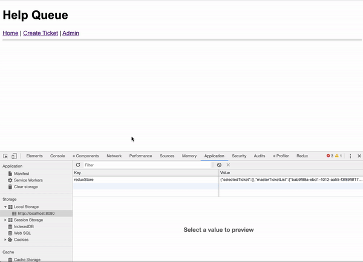

# Epicodus Help Queue

#### _React: Epicodus Help Queue, Last Update 02/03/2020_

## Description
Create a mock application of Epicodus Help Queue. 

## About this application
- Application should be built with Webpack.

- Using _Rails-style_ code structure. Reference: [Redux Code structure](https://redux.js.org/faq/code-structure/)

- The submitted form data will be stored in Firebase, and the data gets retrieved from firebase and renders in the main page.

- Style: Use styles-jsx


## Local Storage
Local storage is available at `c6ea8d2` commit. Local storage code need to exist in `/src/middleware/persist-data-locally.js` and call it in `/src/index/jsx`.<br><br>




## Installation:
1. Clone this repo:
```
$ git clone https://github.com/misakimichy/react-help-queue.git
```

2. Install npm:

```
$ npm install
```

3. Run the project:
```
$ npm run start 
```

4. Open up localhost:8080


## Known Bugs
- No known bugs at this time

## Support and contact details
I welcome any feedbacks and questions to misaki.koonce@gmail.com

## Technologies Used
Git, GitHub, Webpack, React, Redux and Firebase

## License
Copyright © 2020 under the MIT License
